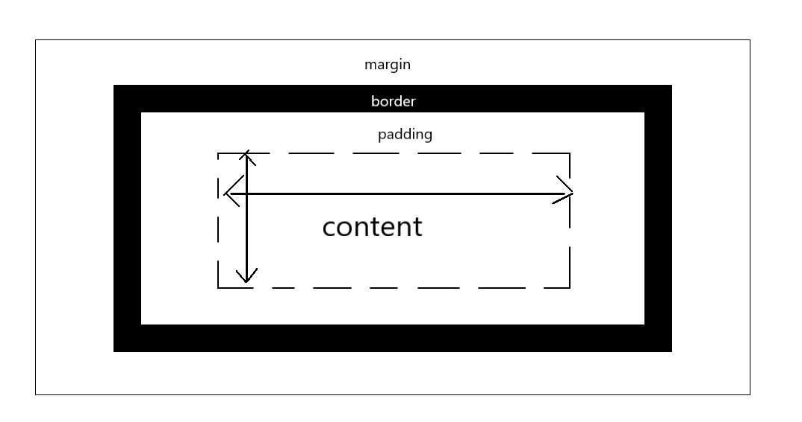

# CSS基础

**三种样式表**

外部样式表：保存在.css文件中

内敛样式表：CSS放在HTML中的<style>中

内联样式：在HTML中的style属性中添加，仅影响一个元素

## 颜色

**CSS的颜色六种方式**

关键词：black, white, silver, gray ...

十六进制：#ff0000

```
RGB：rgb(255,0,0)

RGBA：rgb(255,0,0,0.5)
```

红色，绿色，蓝色

```css
HSL：hsl(0,100%,50%)

HSLA：hsl(0,100%,50%,0.5)
```

色相(hue)，饱和度(saturation)，明度(lightness)

## 字体

### 字体相关知识

**字体分类**

Sans-serif 无衬线字体

serif 有衬线字体

**字体相关网站**

fonts.google.com

www.cssfontstack.com

### 字体的使用

**导入字体**

```css
font-family: Arial,Helvetica,sans-serif;

font-family: Georgia, 'Times New Roman', Times, serif;
```

**字体大小**

```css
font-size: 16px;
```

**字体字重**

```css
font-weight: normal;
```

**文本描述**


```css
text-decoration: underline;
```

**大小写**

```
text-transform: uppercase;
```

**词间距**

```
word-spacing: 4px;
```

## 盒子模型




```
.box1{
    color: red;
    background-color: gray;
    margin-top: 5px;
    margin-bottom: 5px;
    margin-right: 10px;
    margin-left: 10px;
    /* 等价1 */
    /* margin: 5px 10px 5px 10px; */

    /* 等价2 */
    /* margin: 5px 10px; */
    /* border-bottom: 1px firebrick ; */
    border-bottom: 1px firebrick double;
    border-bottom-width: 8px;
    border-bottom-style: dashed;
}
```

如果没有给出四个方向的数值。

比如只有两个方向的数值，那么是先“上下”，再“左右”。

### eg1

```html
        <div class="box1">
            <h1>Hello World</h1>
            <p>Lorem ipsum dolor sit amet consectetur adipisicing elit. Aliquid, fuga, et officia perspiciatis eos
                provident
                numquam quis, quia excepturi quisquam dolores expedita dolor iure explicabo accusantium. At cum quisquam
                voluptatibus!</p>
            <button>Button</button>
        </div>
```

---

```css
.box1{
    color: red;
    background-color: gray;
    margin-top: 5px;
    margin-bottom: 5px;
    margin-right: 10px;
    margin-left: 10px;
    /* 等价1 */
    /* margin: 5px 10px 5px 10px; */

    /* 等价2 */
    /* margin: 5px 10px; */
    /* border-bottom: 1px firebrick ; */
    border-bottom: 1px firebrick double;
    border-bottom-width: 8px;
    border-bottom-style: dashed;
}

.box1 h1{
    text-align: inherit;
}

.box1 button{
    background-color: #555555;
    border-radius: 5px;
    color: #ffffff;
    padding: 10px 15px;
}
.box1 button:hover{
    background-color: red;
}
.box1 button:active{
    background-color: white;
}

```


dashed可以做边框

可以使用hover与active这两个事件可以触发一些新的事件

### eg2

```html
        <div class="box2">
            <h1>Hello World</h1>
            <p>Lorem ipsum dolor sit amet consectetur adipisicing elit. Aliquid, fuga, et officia perspiciatis eos
                provident
                numquam quis, quia excepturi quisquam dolores expedita dolor iure explicabo accusantium. At cum quisquam
                voluptatibus!</p>
            <button>Button</button>
            <br>
            <a href="">goto baidu</a>
        </div>
```

---

```css
.box2 {
    margin: 10px;
    border: 5px dotted red;
    padding: 10px;
}
.box2 h1{
    text-align: center;
}

.box2 a{
    text-decoration: none;
    color: gray;
}
.box2 a:hover{
    color: cyan;
}
```

---


text-align可以让文本居中

border可以使用dotted等属性

### eg3

```html
        <div class="box3">
            <h1>Nihao Sekai</h1>
            <div class="block">
                <p>Lorem ipsum dolor sit amet consectetur adipisicing elit. Minus explicabo laborum omnis assumenda
                    dicta
                    quaerat ullam repellat ipsum doloribus asperiores, facere, rerum nobis. Repellendus animi ut
                    repellat
                    totam maiores voluptatibus!</p>
            </div>
            <div class="block">
                <p>Lorem ipsum dolor sit amet consectetur adipisicing elit. Minus explicabo laborum omnis assumenda
                    dicta
                    quaerat ullam repellat ipsum doloribus asperiores, facere, rerum nobis. Repellendus animi ut
                    repellat
                    totam maiores voluptatibus!</p>
            </div>
            <div class="block">
                <p>Lorem ipsum dolor sit amet consectetur adipisicing elit. Minus explicabo laborum omnis assumenda
                    dicta
                    quaerat ullam repellat ipsum doloribus asperiores, facere, rerum nobis. Repellendus animi ut
                    repellat
                    totam maiores voluptatibus!</p>
            </div>
            <div class="main">
                <p>Lorem ipsum dolor sit amet consectetur adipisicing elit. Minus explicabo laborum omnis assumenda
                    dicta
                    quaerat ullam repellat ipsum doloribus asperiores, facere, rerum nobis. Repellendus animi ut
                    repellat
                    totam maiores voluptatibus!</p>
            </div>
            <div class="sidebar">
                <p>Lorem ipsum dolor sit amet consectetur adipisicing elit. Minus explicabo laborum omnis assumenda
                    dicta
                    quaerat ullam repellat ipsum doloribus asperiores, facere, rerum nobis. Repellendus animi ut
                    repellat
                    totam maiores voluptatibus!</p>
            </div>
            <div class="clearfix"></div>
        </div>
```

---

```css
.box3 .block{
    float: left;
    width: 33%;
    border: 1px solid rebeccapurple;
    box-sizing: border-box;
}
.box3 .block:hover{
    border: 1px dotted red;
}

.box3 .main{
    float: left;
    width: 70%;
    border: 1px solid red;
    box-sizing: border-box;
}

.box3 .sidebar{
    float: right;
    width: 30%;
    border: 1px solid red;
    box-sizing: border-box;
}

.clearfix{
    clear: both;
}

```

---


使用浮动，在一行中更灵活的展示元素。

在所有浮动元素设置完成后，不要忘了**清除浮动**。

### eg4

```html
        <div class="box4">
            <ul class="list">
                <li>Item</li>
                <li>Item</li>
                <li>Item</li>
                <li>Item</li>
                <li>Item</li>
                <li>Item</li>
                <li>Item</li>
            </ul>
        </div>
```

---

```
.box4 .list li:nth-child(even){
    background-color: gray;
}

.box4 .list li:nth-child(3){
    background-color: firebrick;
}
.box4 .list li:nth-child(3):hover{
    background-color: blueviolet;
}

.box4 .list li:first-child{
    background-color: snow;
}
```


## 位置

### **相对偏移(relative)**

原来的位置会保留，但是自身的位置会加上偏移量。

### **绝对偏移(absolute)**

绝对偏移原来的位置会丢失，直接计算当前视窗的偏移量。

注意，这里是当前视窗。

举例说明，html代码如下：

```html
        <div class="box5">
            <h1>标题1</h1>
            <h2>标题1</h2>
        </div>
```


### **视图偏移(fixed)**

```html
<button class="navbar">回到顶部</button>
```

---

```css
.navbar{
    position: fixed;
    left: 90%;
    top: 90%;
}
```

